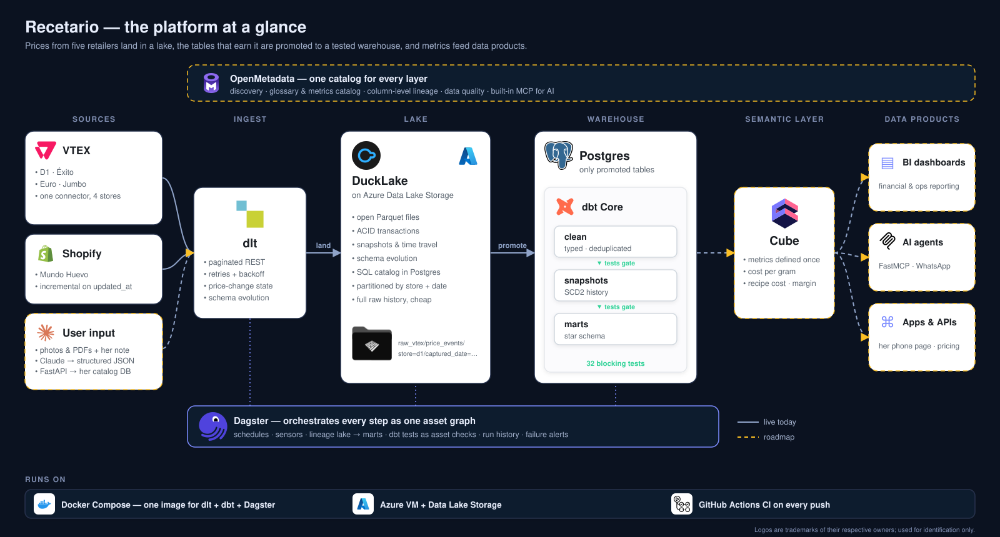
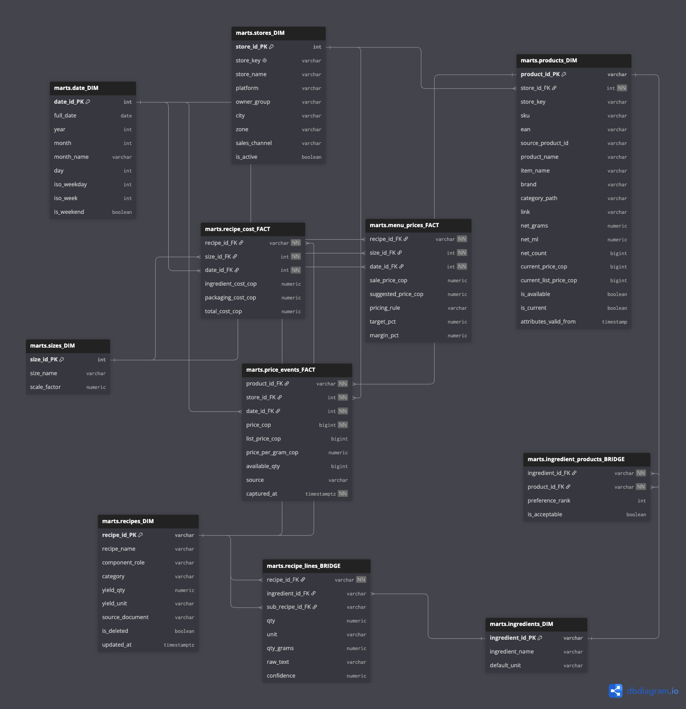

# Recetario: a production-grade data platform for a very small business

[](https://github.com/JHernandez-Educo/recetario/actions/workflows/ci.yml)
[](https://jhernandez-educo.github.io/recetario/)

Recetario is a recipe-costing and margin system for a home bakery in Colombia.
Every week it collects ingredient prices from five retailer e-commerce APIs and
keeps their full history in a data lake on Azure. It promotes the tables that
matter into a Postgres warehouse and models them into a tested star schema.
That answers the questions the baker actually asks:

- *"¿Cuánto me cuesta la torta de limón hoy?"* (How much does the lemon cake cost me today?)
- *"Me pidieron 40 galletas, ¿qué compro y dónde?"* (I got an order for 40 cookies. What do I buy, and where?)
- *"¿Qué subió de precio?"* (What went up in price?)

**The use case is deliberately small, and the engineering deliberately isn't.**
This repo is a case study in how I build data platforms for clients:
- I triage sources with real probes.
- I put the lake first and promote selected tables into the warehouse.
- Ingestion is incremental and remembers its state.
- Tests act as contracts that fail the build.
- There is one lineage graph from raw file to fact table.
- Infrastructure runs the same on a laptop and in the cloud.
- Every technology choice has an exit ramp.

---

## At a glance

| | |
|---|---|
| **Sources** | 4 VTEX grocery chains (D1, Éxito, Euro, Jumbo) and 1 Shopify distributor (Mundo Huevo) |
| **Volume** | about 40,000 products and 24,000 price events in the first load, then a weekly incremental crawl |
| **Lake** | [DuckLake](https://ducklake.select): Parquet on Azure Data Lake Storage Gen2, catalog in Postgres, partitioned by store and date |
| **Warehouse** | Postgres 18. Only the tables that dbt models are promoted from the lake |
| **Transform** | dbt Core: one clean schema per source, SCD2 snapshots (history tables that keep every past version of each row) and a star schema. 42 build-failing tests, 2 warnings and 2 unit tests |
| **Orchestration** | Dagster: 21 software-defined assets in one lineage graph, a weekly schedule, sensors and alerting |
| **Runtime** | One Docker image (dlt + dbt + Dagster) run by Docker Compose on an Azure VM. The same stack runs on a laptop |
| **Quality gates** | Uniqueness on every grain, referential integrity, price sanity checks, and parsing parity proven against the previous engine |

---

## Architecture

<p align="center">
  
</p>

Dagster orchestrates the whole graph. Every dlt table and every dbt model is a
software-defined asset, so the UI draws one connected lineage from the lake,
through the warehouse's raw copies, to the per-source clean schemas, snapshots and marts. The weekly
job runs ingest, then promote, then transform. dbt tests appear as asset
checks, and a failure sensor raises alerts.

---

## The stack, and why each piece

| Layer | Tool | Why this one |
|---|---|---|
| Extract & load | **[dlt](https://dlthub.com)** | Schema inference and evolution, merge/append write modes, incremental cursors, and per-resource state stored with the data. Change detection and DDL are configuration, not hand-written code |
| Lake format | **DuckLake** | An open lake format: Parquet files plus a SQL catalog. Moving storage means copying files and changing one path, never re-loading. dlt supports it natively, including partitioning |
| Lake storage | **Azure Data Lake Storage Gen2** | Cheap, durable object storage with soft delete. The development lake (`az://lake/dev`) is isolated from production (`az://lake/ducklake`) |
| Warehouse | **Postgres 18** | Open source, boring in the best way, and runs everywhere. One server also hosts Dagster's run history and the lake catalog. Read-only and personal roles use built-in privilege roles |
| Promotion | **dlt dataset API** | Reads lake tables with `dlt.dataset()` and loads only new rows into Postgres with dlt's own incremental cursor. Promoted tables are an explicit list in config |
| Transform | **dbt Core** | Business logic as tested, documented SQL. Incremental models, SCD2 snapshots, seeds, and generated documentation ([live site](https://jhernandez-educo.github.io/recetario/)) |
| Orchestration | **Dagster** (+ `dagster-dlt`, `dagster-dbt`) | One asset graph across tools, with asset checks, schedules, sensors and run history stored in Postgres |
| Runtime | **Docker Compose** on an **Azure VM** | One image for the platform code and an idempotent bootstrap. The Dagster UI and Postgres are reachable only through SSH tunnels |
| CI | **GitHub Actions** | Every push parses the dbt project and imports the full Dagster definitions |
| AI-ready | **MCP servers** for dlt and dbt | An agent can inspect pipelines and models directly. The project rule is that every tool enters with its MCP turned on |

---

## Follow one price through the platform

1. **Extract.** The VTEX connector walks each store's category tree and pages
   through products with a custom dlt paginator (about 25 lines). It pauses
   about one second between requests. It saves every HTTP response body to the
   raw archive before parsing anything.
2. **Detect change.** For each SKU, a fingerprint of price and list price is
   kept in **dlt resource state**. A `price_events` row is emitted only when
   the fingerprint changes, so running twice gives zero duplicate events.
3. **Land in the lake.** dlt writes Parquet to DuckLake on Azure, for example
   `raw_vtex/price_events/store=d1/captured_date=2026-10-01/`. dlt's pipeline
   state is saved inside the lake too, so a brand-new container picks up where
   the last run stopped.
4. **Promote.** The `lake_to_warehouse` connector copies only the six tables
   dbt needs into Postgres. Price events move incrementally, keyed on the
   lake's load ID. Small current-state catalogs are replaced each run.
5. **Clean.** dbt types each source in its own schema (`clean_vtex`, `clean_shopify`). It also parses each
   retailer's package-size format into `net_grams`, `net_ml` and `net_count`.
   One chain writes "50 G" inside the number field, and another hides sizes in
   nested JSON strings.
6. **Remember.** A dbt snapshot (SCD2) versions product attributes, so a
   discontinued product keeps its row.
7. **Model.** `price_events_FACT` (grain: product × observation time) carries
   `price_per_gram_cop`, the cross-store comparison measure. It joins
   `products_DIM`, `stores_DIM` and `date_DIM`, and referential-integrity tests
   guard every key.

---

## The warehouse model

<p align="center">
  
</p>

The schema has two stars that share conformed dimensions:
- **Live:** `price_events_FACT` with `products_DIM`, `stores_DIM` and `date_DIM`. This is the price history the platform collects every week.
- **Planned (recipe costing):** `recipes_DIM`, `ingredients_DIM` and `sizes_DIM`, joined through two bridges:
  - **`recipe_lines_BRIDGE`** is a recursive bill of materials. A cake is a bizcocho, plus a relleno, plus a cobertura.
  - **`ingredient_products_BRIDGE`** maps each ingredient to the store products she accepts, as a brand-preference ladder.
- **Two planned facts sit on top:** `recipe_cost_FACT` tracks what each recipe costs today at each size, and `menu_prices_FACT` tracks what she charges, priced by markup or margin.

The diagram is generated from [docs/diagrams/star_schema.dbml](docs/diagrams/star_schema.dbml).

---

## Engineering decisions worth reading

1. **Native first, custom last.** Paginators, incremental cursors, resource
   state, partitioning, promotion and lineage all come from dlt, dbt and
   Dagster built-ins. The custom code is mostly the per-retailer parsing that
   no library could know.
2. **One parameterized connector per platform, not per store.** Four retailers
   share one VTEX extractor, and adding a store is a configuration entry.
3. **Change detection matched to what each API permits.** Shopify exposes
   `updated_at`, so it gets a true incremental cursor. VTEX has no change feed,
   so it gets a polite full pull plus the price-hash diff.
4. **Lake first, warehouse by choice.** Everything lands in the lake, cheaply,
   with full history. The warehouse gets only tables that earn their place,
   through an explicit promotion list. Lineage makes the boundary visible:
   `lake/raw_vtex/products` → `raw_vtex/products` → `clean_vtex/products`.
5. **Partition by how the data is queried.** Price history is partitioned by
   store and capture date, and current-state catalogs by store, all through
   dlt's native partition hints.
6. **Duplicates policy: clean means clean.** Raw keeps every sighting.
   Deduplication happens only at the raw → clean boundary, by a written rule
   (most frequent price in a crawl, then lowest) that dbt unit tests prove.
   Every model after that carries a uniqueness test on
   its grain that fails the build. **It already caught a real defect.** One
   retailer listed a product under three categories with inconsistent prices.
   The test stopped the build, the marts kept their last good state, and the
   bad rows never reached a report.
7. **Monetary sanity as a failing test.** VTEX mixes pesos and centavos in a
   single payload. Every product row carries a cross-check, and a singular
   test fails the build on any ×100 mismatch.
8. **Proven parity during migration.** When the warehouse moved from DuckDB to
   Postgres, package-size parsing was compared row by row on all 40,233
   products across all five retailers, and every row matched.
9. **House naming kept exactly.** Tables like `price_events_FACT` and keys like
   `product_id_PK` keep their case in Postgres through quoted identifiers.
   Postgres has no setting for this, so the convention is enforced in models
   and tests.
10. **Idempotent bootstrap.** `docker compose up` creates the databases and
    roles if they're missing, every time, safely. dlt restores pipeline state
    from the lake. Nothing needs a manual first step.
11. **Sequential by design.** Every job runs one step at a time, to stay polite
    to the retailers and to avoid catalog races. Parallel crawling across
    different stores is a planned, measured change, not an accident.
12. **Modeling stance.** Operational master data (recipes, ingredients,
    preference ladders) is normalized. Event history (prices, receipts) is a
    dimensional star. Dimensions are conformed views of the master data, and
    dbt is the seam between the two.

---

## Reliability and quality

| Concern | What's in place |
|---|---|
| Flaky APIs | dlt's REST client retries with exponential backoff: 5 attempts, backoff factor 2, 60-second timeout |
| Politeness | About 1 request per second per store, night runs, and a hard stop on repeated 4xx responses |
| Data correctness | 42 build-failing dbt tests and 2 unit tests: uniqueness on every grain, not-null keys, relationships, price ranges, accepted values and the ×100 check. 1 warn-level outlier test |
| Failure blast radius | A failing test skips everything downstream, so marts keep their last good version. Stale, never wrong |
| State | Incremental state lives with the data (dlt state in the lake and in Postgres), not on a disk that can vanish |
| Run history | Dagster stores runs, schedules and sensor cursors in Postgres, so they survive container rebuilds |
| Access | Postgres and the Dagster UI listen only inside the VM. People and tools connect through SSH tunnels, with read-only and personal read-write roles |
| CI | Every push validates the dbt project and the full Dagster definitions |

The robustness roadmap is at the end of [docs/platform-guide.md](docs/platform-guide.md).
It covers retry policies, data freshness checks, backups, alerting, and log
and disk limits.

---

## Operating the platform

New to dlt, dbt or Dagster? **[docs/platform-guide.md](docs/platform-guide.md)**
explains which tool answers which question, how to check platform health in
five minutes, and how to follow the data story from source to report.

## Running it

Requires [uv](https://docs.astral.sh/uv/) and Docker. Exact versions are locked in `uv.lock`.

```sh
uv sync
cp .env.example .env            # then fill in the passwords
docker compose up -d            # Postgres, Dagster (code, webserver, daemon); UI on 127.0.0.1

# one store, from the command line
uv run python -m data_platform.connectors.vtex.run --store d1 --max-categories 2   # polite smoke test
uv run python -m data_platform.connectors.shopify.run --store mundohuevo

# lake → warehouse, then transform + test (dbt reads the Postgres password from .env)
uv run python -m data_platform.connectors.lake_to_warehouse.run
set -a && . ./.env && set +a && uv run dbt build --project-dir data_platform/transform --profiles-dir data_platform/transform
```

## Repository layout

```
data_platform/       the platform (see data_platform/README.md)
  connectors/        1 · extract & load: dlt (vtex, shopify, recipes, lake_to_warehouse)
  transform/         2 · per-source clean schemas, snapshots, star schema, tests: dbt
  orchestration/     3 · what runs, when: Dagster assets, jobs, schedules, sensors
  deploy/            how it runs: Dockerfile, Dagster instance config, Postgres bootstrap
docs/                engineering docs: platform guide, dbt conventions, diagrams (generated from code)
compose.yaml         the platform stack
.dlt/config.toml     non-secret pipeline settings (secrets stay in gitignored files)
```

## Scraping posture

The connectors use public storefront endpoints only. They make about 1 request
per second per store, crawl at night, back off and retry realistically, stop
hard on repeated 4xx responses, and respect robots.txt. One retailer was
excluded until its robots policy was re-checked. A weekly crawl is about 1,100
page requests across all stores. Any source that objects gets dropped.

## Roadmap

- **Recipe intake and pricing:** a small API and a phone page where the baker
  uploads a recipe photo or PDF. Claude extracts structured JSON against the
  recipe contract. She reviews it, and the platform prices every component at
  every size, with the cheapest store for each ingredient and a suggested
  price at her target markup.
- **Serving:** `recipe_cost`, `margin` and `buy_list`, through an API and an
  MCP server, so the baker can ask questions in Spanish from her phone.
- **Operations:** auto-deploy from GitHub, nightly backups, HTTPS with a login
  for the UIs, and Slack and phone alerts.
- **Catalog:** OpenMetadata for column-level lineage and lake discovery.
